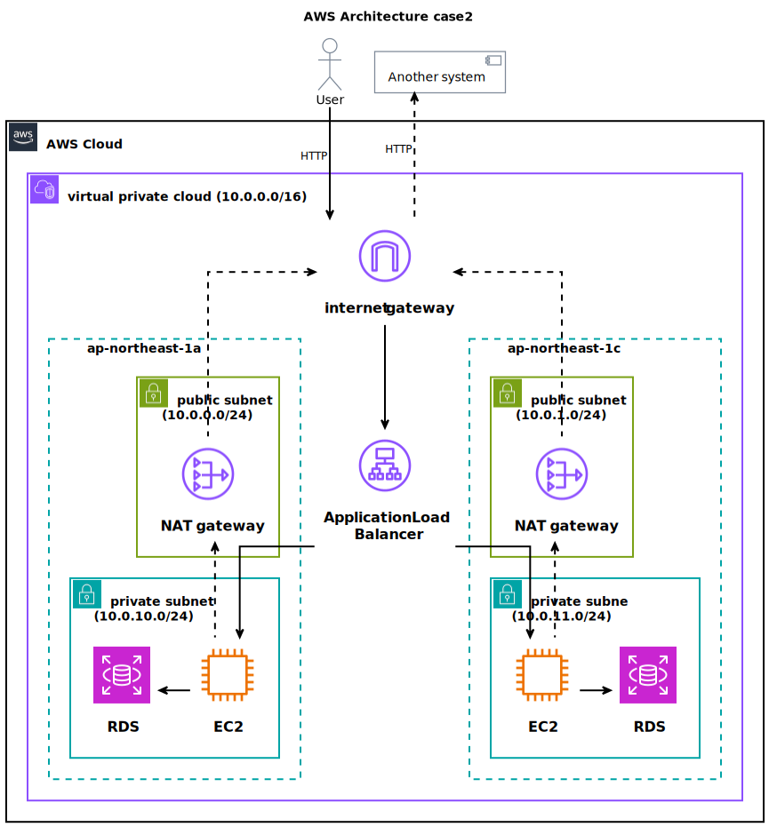

# case2: 高可用性ウェブアプリケーションの構築

AWS上に高可用性かつスケーラブルなウェブアプリケーションインフラを構築する

# 構成要件

## ネットワーク

- VPC
  - 10.0.0.0/16 の CIDR を持つ VPC を作成
- サブネット
  - 2つのアベイラビリティゾーン（AZ）にまたがる パブリックサブネット（ALB用）
  - 2つのAZにまたがる プライベートサブネット（EC2用）

## ロードバランシング

- Application Load Balancer
  - インターネット向けのエントリーポイント
  - 各EC2インスタンスにトラフィックを分散

## スケーリング

- Auto Scaling Group
  - 必要に応じてEC2インスタンスを自動でスケールイン/アウト

## データベース

- RDS（MySQL/PostgreSQL, Multi-AZ 配置）
  - 高可用性を確保するため、2つのAZにまたがる構成

## セキュリティ

- セキュリティグループ
  - ALB、EC2、RDS に適切なアクセス制御を設定
