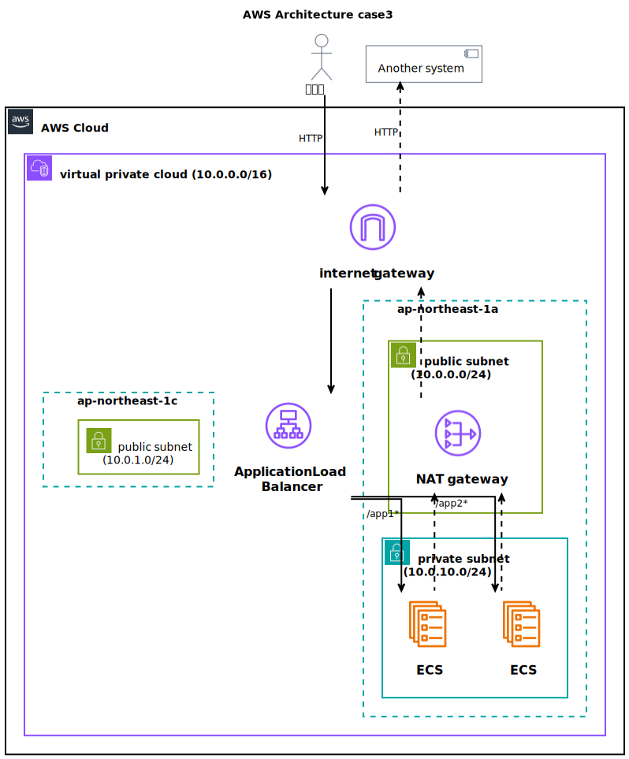

# case3: マイクロサービスアーキテクチャの構築（ECS利用）

コンテナベースのマイクロサービスアーキテクチャをAWS ECS上に構築する

# 構成要件

## コンテナオーケストレーション

AWS ECSを利用し、複数のマイクロサービスをデプロイ

## ロードバランシング:

ALBを用いて、トラフィックの分散を実現

## ネットワーク・セキュリティ:

適切なVPC設定、セキュリティグループのルール設定など