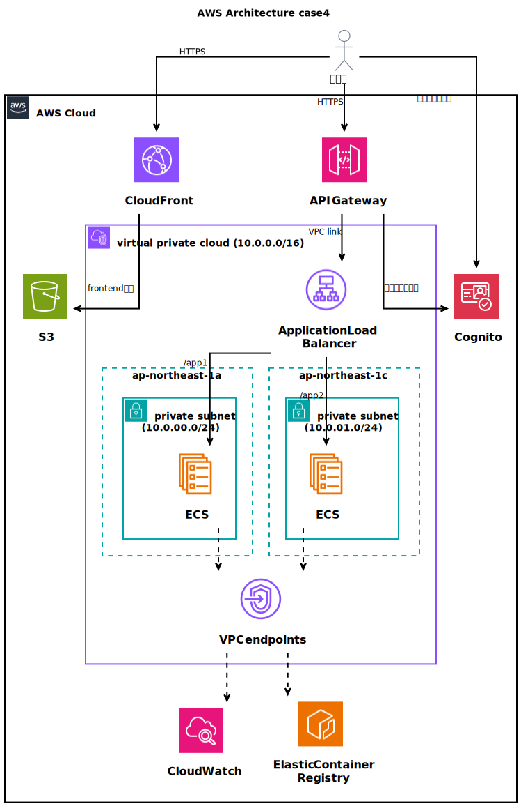

# case4: HTTPS対応、認証認可、フロント・サーバー分離型のECSアプリ構築

シングルページアプリケーションを AWS ECS上で運用し、API Gatewayを用いて Cognito と連携した認証を管理。通信はすべて HTTPS のみで行う。



# 構成要件

## フロントエンド
- SPA（シングルページアプリケーション）を開発
- ビルド後の静的ファイルをS3に配置し、CloudFrontでキャッシュし、高速化する
- すべての通信は、CloudFrontで管理されたHTTPS のみを許可

## 認証（Cognito + API Gateway）
- AWS Cognito の User Pool を利用
- API Gatewayを通じて、Cognitoからトークンを発行し、ALBへのアクセスはトークン検証されたリクエストのみを許可する


## バックエンド（Amazon ECS）
- マイクロサービスをコンテナ化してデプロイ
- コンテナイメージはECRで管理し、ECR・ECS間はvpcエンドポイントを用いてインターネットを介さず通信を行う
- API Gatewayで認証を通過したトラフィックのみ ECS に到達する構成にする（ECS のアプリは認証ロジック不要）
- すべての通信は、API Gatewayで管理されたHTTPS のみを許可
- CloudWatchでログ監視

## ロードバランシング
- ALB (Application Load Balancer) をAPI Gatewayの後ろに配置
- トラフィック量に応じて EKS 上の各サービスを自動スケーリング

## ネットワーク・セキュリティ
- VPC 内に ECS クラスタを構築し、パブリック/プライベートサブネットを適切に分割
- セキュリティグループで API Gateway → ALB → ECS 間の通信を限定し、外部から直接 ECS や ALBへアクセスできないように設計

# 開発関係

## テスト方法

1. terraform applyあと、出力されるcognito_login_infoのurlを開く
2. cognito_login_infoのuser、passwordを使ってログインする
3. 認可コードをcognito_login_infoのtoken_commandに入力して実行し、各種トークンを取得する
4. api_gateway_infoのコマンドにトークンを設定し、APIコールを行う

## AWS SSMのSession Manager機能を利用したECSへの接続
下記コマンドでECSに接続可能
```bash
aws ecs execute-command \
    --cluster webapp-cluster \
    --task {task_id} \
    --interactive \
    --command "/bin/bash"
```