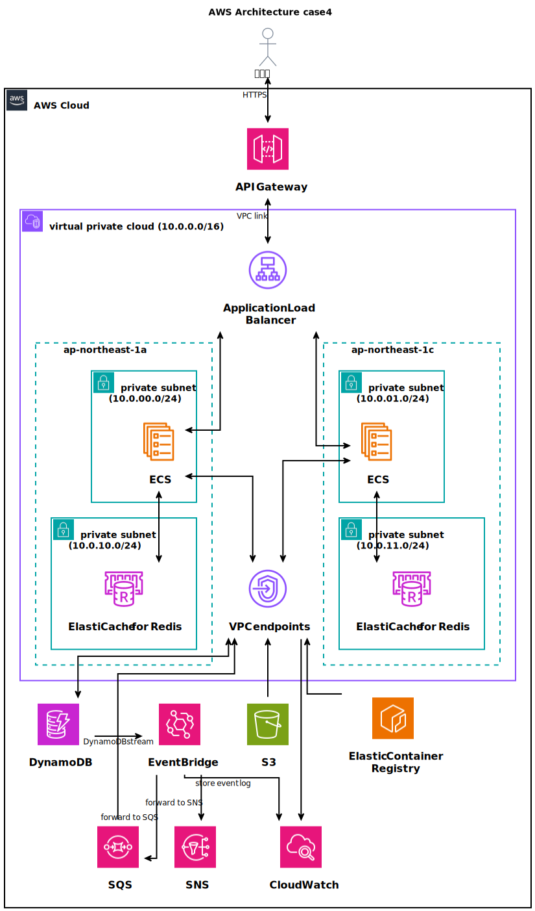
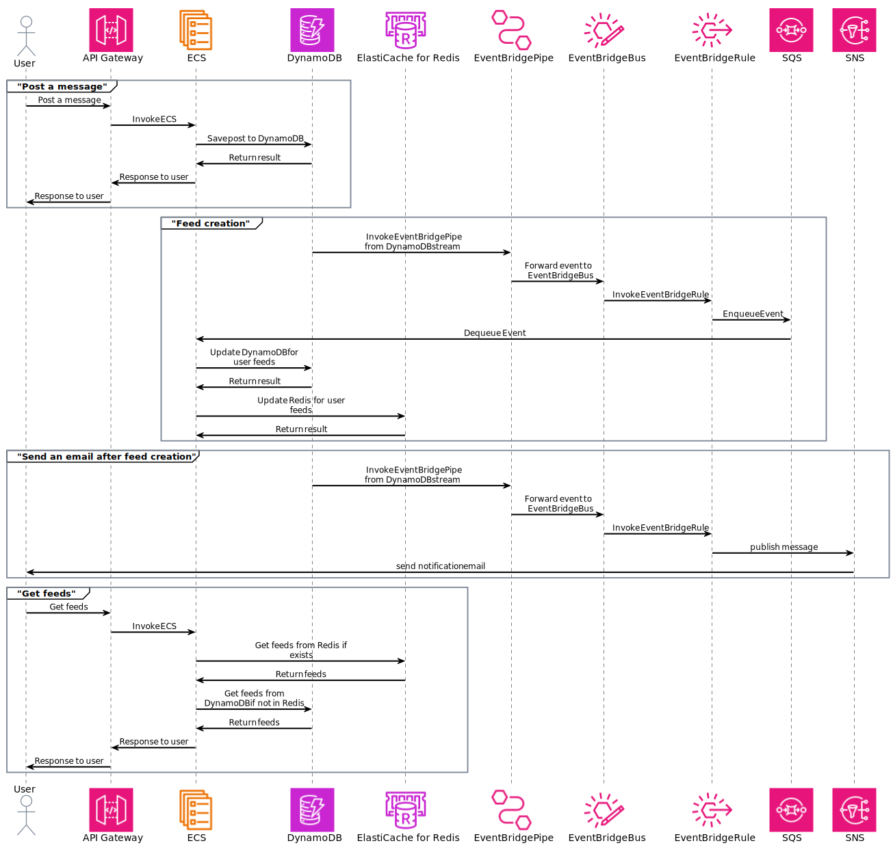

# case5: CQRS + FANOUTを用いたSNSアプリアーキテクチャ構築

AWS を利用して CQRS (Command Query Responsibility Segregation) と Fanout (ファンアウト) のパターンを実装し、SNS アプリケーションの一部を構築する。
具体的には、以下の特徴を持つ。
- CQRS: 書き込み (Command) と読み込み (Query) を分けることで、パフォーマンスを最適化。
- Fanout: 投稿イベントを複数のサーバーに非同期で配信し、複数のユーザーに同時に通知。

# 構成図

# シーケンス図

# 構成要件

## 書き込み処理 (Command)
- ユーザーが投稿を作成した際の書き込み処理
- API Gateway: ユーザーの投稿リクエストを受け取る。
- ECS: 投稿データを処理し、DynamoDB に保存。

## イベントの発行 (EventBridge)
- 投稿の作成が完了したら、EventBridge によって SQS に通知を送る
- EventBridge: "New Post" イベントを発行。
    - 直接SNSでないため、下記メリットがある。
        - フィルタリングやルールベースの処理を挟める
        - 他のシステムにも配信可能。
        - イベントの履歴とログの管理が可能

## 非同期処理
- フォロワーへの通知処理を非同期で行うため、以下のリソースを利用
    - SQS: フォロワー数に応じて、個別のキューで処理を行う
    - ECS: SQS メッセージを処理し、DynamoDB / Redisにフォロワーのフィードを更新

## 通理処理（FanOut）
- フィードを更新後、EventBridge によって SNS に通知を送る
- SNSを通じて、各種の通知方法でユーザーに通知を送る

## 読み込み処理 (Query)
- ユーザーが自分のフィードを取得した際の読み込み処理
- API Gateway: ユーザーのフィード取得リクエストを受け取る
- DynamoDB / Redisから、事前に構築されたフィードを読み込む